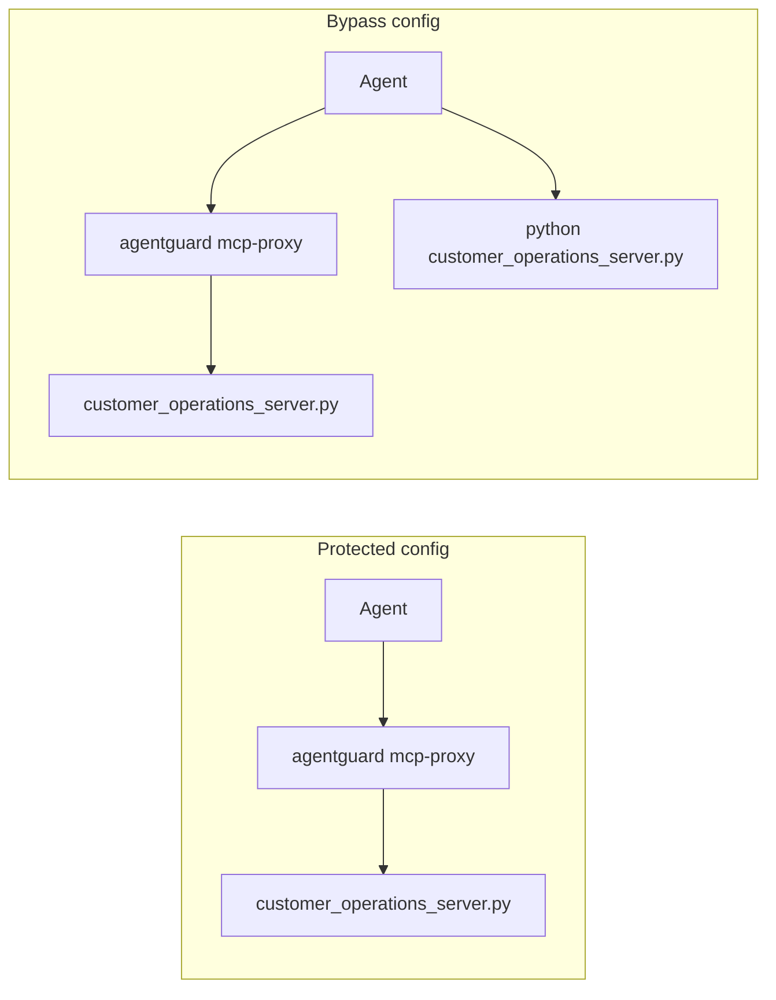

# MCP posture audit

AgentGuard can audit MCP client configuration for routes that **bypass** a protected proxy. This is configuration posture, not a claim that arbitrary MCP servers become secure.

The current classifier treats `agentguard mcp-proxy ... -- <downstream>` as a protected route. Direct command or URL routes are unmediated.

## Configurations

### Protected (`protected.json`)

One server is launched through `agentguard mcp-proxy`.

Expected:

- CLI exit `0` with `--fail-on-bypass`
- status `protected`
- reason `mcp.agentguard_proxy_enforced`

### Bypass (`bypass.json`)

The same downstream command is present twice: once through the proxy, once as a direct `python` launch. AgentGuard treats that as a **parallel direct bypass**.

Expected:

- CLI exit non-zero with `--fail-on-bypass`
- status `direct` on the unmediated route
- reasons `mcp.direct_connection_bypasses_agentguard` and `mcp.parallel_direct_bypass`

These files are sanitized examples. They do not include secrets or live endpoints.

## Run

```bash
./run.sh
```

## Flow



The bypass graph is what `mcp-posture --fail-on-bypass` rejects: a protected path exists, but an unmediated path to the same downstream is also configured.

## Limits

- The audit sees only the configuration files it is given.
- It cannot prove the absence of hidden, generated, or network-level routes.
- `mcp-proxy` in these fixtures is the command token the current posture scanner recognizes as an AgentGuard-mediated route.
