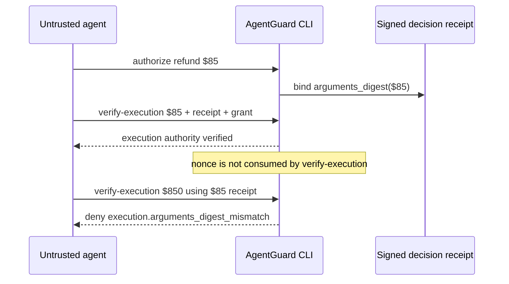

# Refund agent: post-authorization argument mutation

This is the hero demonstration. A support agent is authorized to issue an **$85** refund. After authorization, the tool arguments are changed to **$850**. On the protected verification path, AgentGuard rejects the mutated action.

This demo uses the AgentGuard CLI. It does **not** contact a payment processor.

## Scenario

| Field | Value |
|---|---|
| Workload | `prod/support-agent-v3` |
| Tool | `refund.create` on `customer-operations` |
| Authorized amount | `$85.00` (`amount_minor: 8500`) |
| Policy ceiling | `$100.00` (`amount_minor: 10000`) |
| Mutated amount | `$850.00` (`amount_minor: 85000`) |
| Expected reason | `execution.arguments_digest_mismatch` |

Policy still permits refunds up to $100. The $850 attempt is rejected because it is **not the authorized action**, not because it exceeds the $100 policy cap.

## What each command proves

1. `agentguard init` — creates a temporary workspace and signing keys.
2. `agentguard authorize` — evaluates the $85 intent against `policy.yaml` and issues a signed decision receipt.
3. `agentguard broker-demo` — issues a development credential grant bounded by the receipt ceiling. This is a local broker adapter, not a production vault.
4. `agentguard verify-execution` on the $85 request — preflight check that execution authority matches the receipt and grant. The CLI reports that the **nonce is not consumed**.
5. `agentguard verify-execution` on the mutated $850 arguments — must exit non-zero with `execution.arguments_digest_mismatch`.

`verify-execution` is execution-authority verification. It is the CLI preflight for the protected path. It does not dispatch an external refund.

## Run

From this directory:

```bash
./run.sh
```

Preserve the generated workspace:

```bash
./run.sh --keep-workspace
```

The script exits 0 only when the $85 preflight succeeds **and** the $850 attempt is rejected with the expected reason code.

## Attack flow


