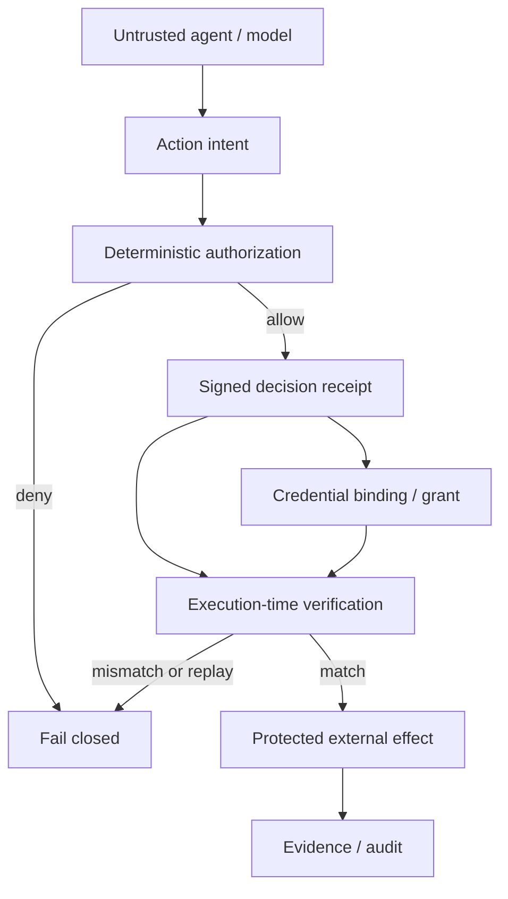

# Architecture

AgentGuard is runtime authorization infrastructure for AI agents. It sits between an untrusted agent proposal and a protected external effect.

The invariant is:

```text
Authorized Intent
    -> Bounded Credential Authority
    -> Admitted Dispatch
    -> Evidence-Bound Outcome
```

Model output is treated as a proposal, not as an authorization boundary.

## Protected flow



| Stage | Role |
|---|---|
| Action intent | Normalized request: principal, action, resource, arguments, effects, provenance |
| Authorization | Deterministic policy evaluation; issues a signed decision receipt |
| Decision receipt | Binds canonical digests of the approved intent, policy, budget, and credential ceiling |
| Credential grant | Development or production grant must stay within the receipt ceiling |
| Execution verification | Recomputes digests and compares them to the receipt before authority is claimed |
| Protected effect | Only after reservation; this showcase uses a fake in-process executor unless an MCP adapter is in path |
| Evidence | Hash-chained audit and optional signed evidence bundles |

## Trust boundaries

**Untrusted / probabilistic**

- The model, planner, prompt, and tool-calling agent
- Upstream argument mutation, retries, and compromised orchestrators
- MCP client configuration that can introduce extra routes

**Deterministic enforcement**

- Policy evaluation
- Receipt signature verification
- Canonical digest comparison
- Credential-ceiling checks
- Durable nonce reservation / replay rejection
- MCP posture classification of supplied configs

**Trusted by assumption, not proven by this showcase**

- Host OS and filesystem
- Signing-key confidentiality
- Accuracy of identity and provenance labels supplied by the adapter
- The final provider after a verified dispatch
- Completeness of MCP configs given to `mcp-posture`

## Replay and state

`verify-execution` is a **non-consuming preflight**. It can prove that a live intent matches a receipt without claiming the nonce.

Protected execution (`execute_protected`, MCP protected adapters) **reserves** the decision nonce in SQLite. A second claim of the same receipt fails with `decision_receipt.replayed`.

## Credential binding

A grant is not a generic capability token. AgentGuard checks that requested audience, scopes, tenant, and TTL do not exceed the signed `credential_ceiling`. `broker-demo` is a local development adapter used by these demos; it is not a production secret vault.

## Execution-time comparison

Receipts store separate digests, including `arguments_digest`. If tool arguments change after authorization, verification fails with `execution.arguments_digest_mismatch` before protected dispatch.

## Evidence

Protected runs can emit audit events and signed evidence bundles (`evidence-build` / `evidence-verify` in the core CLI). This showcase does not treat evidence packaging as a fourth attack demo.

## MCP

Two different controls exist:

1. **Runtime mediation** — `mcp-proxy` / `mcp-proxy-v2` force tool calls through the execution-integrity path.
2. **Posture audit** — `mcp-posture` inspects client config files for unmediated or parallel routes.

The public MCP demo exercises (2). It does not claim that MCP itself is “made secure.”
